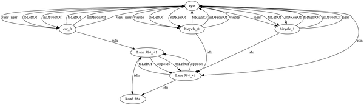

# Carla Scene Graphs

This repo contains code to generate Scene Graphs for the CARLA simulator.
We have detailed guides in the [docs folder](./docs) explaining the scene graph generator (SGG) as well as instructions and demos on how to utilize the framework.

* [Main components and functions](./docs/Main-components-and-functions.md)
* [Abstractions](./docs/Abstractions.md)
* [How to instantiate it](./docs/How-to-instantiate-it.md)
* [Example with CARLA Leaderboard 2.0](./docs/Example-with-CARLA-Leaderboard-2.0.md)

# Installing CARLA
This Python module interfaces with the CARLA API to generate scene graphs by querying the state of the simulator.
This has been tested with several versions of CARLA including `0.9.10` and `0.9.14`. 
Note that the CARLA API is not always backward compatible - if you identify errors working on new versions of CARLA,
the interface may have changed.

Instructions for installing CARLA version `0.9.14` and the relevant dependencies can be found in [this README](./install_carla.md).

## Publications using this plugin
This plugin has been successfully deployed in several techniques. Please let us know if you use the tool!
* ICSE'24 [link](https://dl.acm.org/doi/abs/10.1145/3597503.3639178) S3C: Spatial Semantic Scene Coverage for Autonomous Vehicles
* ICRA'24 [link](https://ieeexplore.ieee.org/abstract/document/10610973/) Specifying and Monitoring Safe Driving Properties with Scene Graphs
