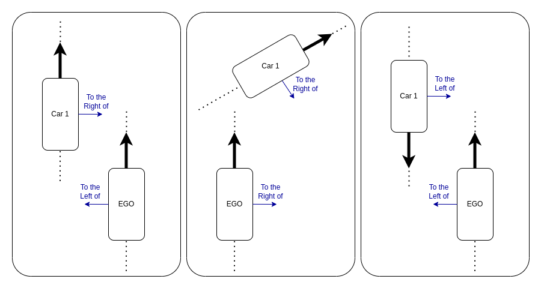
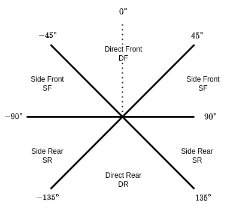

# Abstractions
The scene graph generated by the tool contains a highly detailed map of the roadbed based on [CARLA's internal waypoint structure](https://carla.readthedocs.io/en/latest/core_map/#waypoints).
Each entity contains attributes containing many elements of its physical state including its position, orientation, blueprint, and bounding box.
This detailed SG, referred to as `sg` below, is not intended for general use and instead is meant as an extensible intermediary.
All prior approaches that have leveraged the tool have used the RoadScene2Vec-style abstractions described below.

## RoadScene2Vec-Style Abstractions
The most widely-used abstraction that we generate is inspired by that of RoadScene2Vec.
This abstraction has two types of relationships: semantic and spatial.
By default, we only allow for relationships between the ego vehicle and other entities, but this can be extended to allow for relationships between any pair of entities, e.g. between cars and trucks, which can be separately configured for both distance and angular relationships.

### Semantic Relationships

| Short Name   | From     | To         | Description                                                                                                                                                         |
|--------------|----------|------------|---------------------------------------------------------------------------------------------------------------------------------------------------------------------|
| `isIn`       | `Entity` | `Lane`     | `Entity` is within the `Lane`. An entity can be in multiple lanes. If an entity is in no lanes, a singleton `Off Road` node will be created that the entity `isIn`. |
| `isIn`       | `Lane`   | `Road`     | `Lane` is within the roadbed of `Road`.                                                                                                                             |
| `isIn`       | `Road`   | `Junction` | `Road` is within the `Junction`. This follows the [ASAM OpenDRIVE](https://www.asam.net/standards/detail/opendrive/) conventions.                                   |
| `opposes`    | `Lane1`  | `Lane2`    | Lanes have opposite flow of traffic.                                                                                                                                |
| `travelsTo`  | `Lane1`  | `Lane2`    | Traffic can flow from `Lane1` to `Lane2`, e.g., `Lane1` leads to the junction and `Lane2` is its continuation in the junction.                                      |
| `laneChange` | `Lane1`  | `Lane2`    | Traffic can change from `Lane1` to `Lane2`.                                                                                                                         |

### Distance relationships
The distances used to define the relationships in the graph are tunable.
We extend the five defaults used by RoadScene2Vec, adding a new nearest distance `safe_hazard` for entities closer than 2m, and a maximum distance of 50 meters.

| Criteria            | Short Name    | Long Name                    |
|---------------------|---------------|------------------------------|
| *dist* < 2m         | `safe_hazard` | Safety Hazard                |
| 2m <= *dist* < 4m   | `near_coll`   | Near Collision               |
| 4m < *dist* <= 7m   | `super_near`  | Super Near                   |
| 7m < *dist* <= 10m  | `very_near`   | Very Near                    |
| 10m < *dist* <= 16m | `near`        | Near                         |
| 16m < *dist* <= 25m | `visible`     | Visible                      |
| 25 < *dist* <= 50m  | N/A           | No Distance Relation         |
| 50 < *dist*         | N/A           | Entity not included in graph |

### Angular Relationships
The angular relationships are divided into 2 categories.

The first captures a single relationship of left versus right and is given relative to the vehicle; this is not parameterizable.
Note that it is possible for two vehicles to both be on each others' left or right.
Consider the scenarios in the image below.
In the first case, car 1 is to the left of the ego, and ego is to the right of car 1 because they are both travelling in the same direction.
In the second case, both ego and car 1 are to the right of each other because car 1 is turned at an angle.
In the third case, both ego and ar 1 are to the left of each other because they are facing opposite directions.

The second captures information about front versus rear and side versus direct, giving 4 combinations: Direct Front (DF), Side Front (SF), Direct Rear (DR), Side Rear (SR).
This is parameterizable by defining the threshold between these distinctions.
The default parameterization uses 45 degree increments, giving each of the 4 combinations 90 degrees total, as shown below:

## Variations
[S3C](https://dl.acm.org/doi/pdf/10.1145/3597503.3639178) explored several variations on the RSV abstraction to include different levels of detail.
The table below describes the different abstractions along with the function call used to generate them.

| Short Name | Description                  | Function in [sgg_abstractor.py](../carla_sgg/sgg_abstractor.py) | Description                                                               |
|------------|------------------------------|-----------------------------------------------------------------|---------------------------------------------------------------------------|
| E          | Entities                     | `process_to_rsv(sg, gen_relationships=False, gen_lanes=False)`  | Semantic Segmentation                                                     |
| EL         | Entities + Lanes             | `process_to_rsv(sg, gen_relationships=False, gen_lanes=True)`   | *E* with ground-truth lane occupation for each entity                     |
| ER         | Entities + Relations         | `process_to_rsv(sg, gen_relationships=True,  gen_lanes=False)`  | *E* with RoadScene2Vec's default inter-entity relationships configuration |
| RSV        | Entities + Lanes + Relations | `process_to_rsv(sg)`                                            | *E* with both lane and relationship information from *EL* and *ER*        |
| SG         | Entities + Road Structure    | `sg`                                                            | *EL* except lanes are modeled as multiple detailed road segments          |